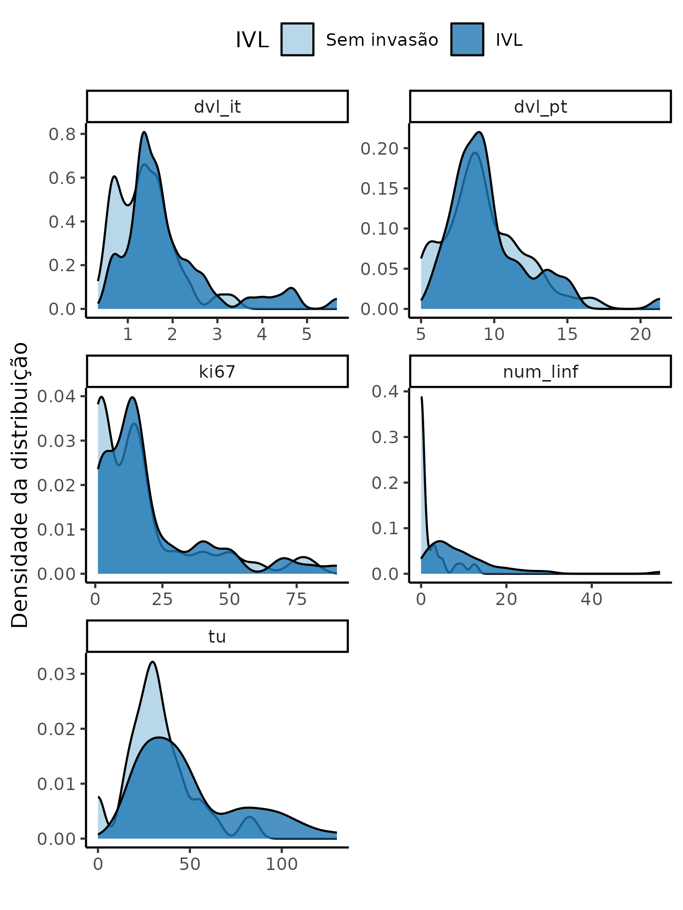

---

\newpage

**Associação entre invasão vascular linfática na densidade vascular linfática e mortalidade em pacientes com câncer de mama: estudo transversal**

**Histórico do documento**

|Versão |Alterações     |
|:------|:--------------|
|01     |Versão inicial |

---

# Lista de abreviaturas

# Contexto

## Objetivos

1. Avaliar a associação entre a invasão vascular linfática e a densidade vascular linfática peritumoral e intratumoral, mensuradas pelo marcador D2-40;
1. Avaliar a associação entre a invasão vascular linfática e a mortalidade;
1. Avaliar a associação entre a invasão vascular linfática e indicadores de patológico;
1. Avaliar a associação entre a invasão vascular linfática e o número de linfonodos acometidos;
1. Avaliar a associação entre a invasão vascular linfática e o tamanho do tumor.

<!-- ## Recepção e tratamento dos dados -->

# Metodologia

Os procedimentos de limpeza de dados, desenho do estudo e métodos de análise usados neste relatório estão descritos no documento anexo **SAP-2023-007-TG-v01**.

<!-- ## Parâmetros do estudo -->

<!-- ### Desenho do estudo -->

<!-- ### Critérios de inclusão e exclusão -->

<!-- ### Exposições -->

<!-- ### Desfechos -->

<!-- ### Covariáveis -->

<!-- ## Análises Estatísticas -->

Esta análise foi realizada utilizando-se o software `R` versão 4.2.1.

# Resultados

## População do estudo e acompanhamento

No total foram incluídos 100 participantes na análise, dos quais
56 (56%) compunham o grupo com IVL (Tabela 1).
A média (DP) de DVL IT observada na amostra de estudo foi 1.66 (0.94) enquanto a DVL PT foi 9.46 (2.74).

O estadiamento pT com maior prevalência na amostra foi
43 (43%),
o estadiamento pM foi
29 (29%)
e a maior parte da amostra não experimentou ocorrência de metástase à distância
(pN = 78 (78%)).

Table: **Tabela 1** Características dos participantes incluídos no estudo.

|               **Características**                | **N = 100** |
|:------------------------------------------------:|:-----------:|
|                  __IVL, n (%)__                  |  56 (56%)   |
|                 __Óbito, n (%)__                 |  67 (67%)   |
|       __DVL (IT), Média (Desvio Padrão)__        | 1.66 (0.94) |
|       __DVL (PT), Média (Desvio Padrão)__        | 9.46 (2.74) |
|                 __Grau, n (%)__                  |             |
|                        0                         |  3 (3.0%)   |
|                        1                         |  13 (13%)   |
|                        2                         |  55 (55%)   |
|                        3                         |  29 (29%)   |
|                 __CM=4, n (%)__                  |             |
|                        1                         |  35 (35%)   |
|                        2                         |  48 (48%)   |
|                        3                         |  6 (6.0%)   |
|                        4                         |  11 (11%)   |
|                  __pT, n (%)__                   |             |
|                        T0                        |  3 (3.0%)   |
|                        T1                        |  14 (14%)   |
|                        T2                        |  43 (43%)   |
|                        T3                        |  12 (12%)   |
|                        T4                        |  28 (28%)   |
|                  __pN, n (%)__                   |             |
|                        N0                        |  28 (28%)   |
|                        N1                        |  22 (22%)   |
|                        N2                        |  21 (21%)   |
|                        N3                        |  29 (29%)   |
|                  __pM, n (%)__                   |             |
|                        M0                        |  78 (78%)   |
|                        M1                        |  22 (22%)   |
| __Tamanho do tumor (mm), Média (Desvio Padrão)__ |   43 (26)   |
| __Número de linfonodos, Média (Desvio Padrão)__  |    6 (8)    |
|         __KI67, Média (Desvio Padrão)__          |   19 (20)   |

Na figura 1 vê-se as distribuições dos indicadores categóricos, em ambos os grupos de participantes.
A mortalidade (obito), pM e CM=4 apresentam distribuições semelhantes em ambos os grupos.
O grau 0 do tumor não foi observado no grupo livre de IVL, assim como o estadiamento pT=T0.
Apenas 1 (1.8%) participante tinha estadiamento pN=N0 no grupo com IVL.

**Figura 1** Distribuição de ocorrência de cada CM=4, grau do tumor, mortalidade (óbito), e indicadores de estadiamento (pM, pN e pT).

**Figura 2** Densidade de distribuição da DVL, KI67, número de linfonodos et tamanho do tumor.

A figura 2 mostra as densidades das distribuições das variáveis contínuas em cada grupo.
Ambas DVL exibem acumulações de frequências em tendências centrais semelhantes entre os grupos, assim como o KI-67.
Apesar da localização da tendência central ser semelhante entre os grupos, tanto a DVL IT como o KI67 parecem ter uma distribuição bimodal no grupo livre de IVL.
O tamanho do tumor (TU) parece ter sua tendência central em localizações semelhantes em ambos os grupos, mas o grupo IVL positivo parece ter uma distribuição bimodal mais bem definida que o grupo livre de IVL.
O número de linfonodos acometidos no grupo livre de IVL parece ter uma acumulação substantialmebte maior em números baixos, enquanto o grupo IVL positivo possui uma amplitude maior em sua distribuição.

Diferenças nestas distribuições serão testadas na próxima seção.
Todas as distribuições apresentam uma assimetria com cauda longa à direita, o que justifica a escolha do teste não paramétrico nos testes de significância.

## Análise inferencial

A DVL IT parece ser maior no grupo IVL quando comparada ao grupo livre de IVL
(p=0.009),
mas notou-se uma maior variabilidade observada na distribuição deste grupo (Tabela 2).
Ambos os grupos parecem ter ocorrências semelhantes tanto na DVL PT quanto na mortalidade.

Table: **Tabela 2** Comparação entre os indicadores entre os grupos livre de IVL e IVL positivo.

|               **Características**                | **Total**, N = 100 | **0**, N = 44 | **1**, N = 56 | **Valor p** |
|:------------------------------------------------:|:------------------:|:-------------:|:-------------:|:-----------:|
|                 __Óbito, n (%)__                 |      67 (67%)      |   26 (59%)    |   41 (73%)    |    0.198    |
|       __DVL (IT), Média (Desvio Padrão)__        |    1.66 (0.94)     |  1.37 (0.64)  |  1.89 (1.07)  |  __0.009__  |
|       __DVL (PT), Média (Desvio Padrão)__        |    9.46 (2.74)     |  9.23 (2.65)  |  9.65 (2.82)  |    0.554    |
|                 __Grau, n (%)__                  |                    |               |               |  __0.039__  |
|                        0                         |      3 (3.0%)      |   3 (6.8%)    |    0 (0%)     |             |
|                        1                         |      13 (13%)      |   3 (6.8%)    |   10 (18%)    |             |
|                        2                         |      55 (55%)      |   28 (64%)    |   27 (48%)    |             |
|                        3                         |      29 (29%)      |   10 (23%)    |   19 (34%)    |             |
|                 __CM=4, n (%)__                  |                    |               |               |    0.801    |
|                        1                         |      35 (35%)      |   16 (36%)    |   19 (34%)    |             |
|                        2                         |      48 (48%)      |   20 (45%)    |   28 (50%)    |             |
|                        3                         |      6 (6.0%)      |   2 (4.5%)    |   4 (7.1%)    |             |
|                        4                         |      11 (11%)      |    6 (14%)    |   5 (8.9%)    |             |
|                  __pT, n (%)__                   |                    |               |               |  __0.006__  |
|                        T0                        |      3 (3.0%)      |   3 (6.8%)    |    0 (0%)     |             |
|                        T1                        |      14 (14%)      |    8 (18%)    |    6 (11%)    |             |
|                        T2                        |      43 (43%)      |   22 (50%)    |   21 (38%)    |             |
|                        T3                        |      12 (12%)      |    6 (14%)    |    6 (11%)    |             |
|                        T4                        |      28 (28%)      |    5 (11%)    |   23 (41%)    |             |
|                  __pN, n (%)__                   |                    |               |               | __<0.001__  |
|                        N0                        |      28 (28%)      |   27 (61%)    |   1 (1.8%)    |             |
|                        N1                        |      22 (22%)      |    9 (20%)    |   13 (23%)    |             |
|                        N2                        |      21 (21%)      |   4 (9.1%)    |   17 (30%)    |             |
|                        N3                        |      29 (29%)      |   4 (9.1%)    |   25 (45%)    |             |
|                  __pM, n (%)__                   |                    |               |               |    0.230    |
|                        M0                        |      78 (78%)      |   37 (84%)    |   41 (73%)    |             |
|                        M1                        |      22 (22%)      |    7 (16%)    |   15 (27%)    |             |
| __Tamanho do tumor (mm), Média (Desvio Padrão)__ |      43 (26)       |    33 (18)    |    50 (29)    |  __0.003__  |
| __Número de linfonodos, Média (Desvio Padrão)__  |       6 (8)        |     2 (3)     |    10 (9)     | __<0.001__  |
|         __KI67, Média (Desvio Padrão)__          |      19 (20)       |    17 (20)    |    20 (21)    |    0.233    |

A distribuição do grau do tumor foi significativamente diferente entre os grupos
<!-- com todos os participantes IVL positivos apresentando grau maior que zero -->
(p=0.039), assim como os estadiamentos
pT (p=0.006) e
pN (p<0.001).
O tamanho do tumor e o número de linfonodos parecem ser maiores no grupo IVL positivo
(p=0.003
e
p<0.001,
respectivamente).
Nesta amostra não foi possível detectar diferença no CM=4 nem no KI67.

# Observações e limitações

**Análise univariada**

As comparações entre grupos nesta análise não combinam a variabilidade *entre* variáveis, estando portanto sujeita à viés e confundimento devido a relações entre as variáveis.
Recomenda-se considerar o uso de análises multivariadas para controlar efeitos de correlação entrecovariáveis.

**Guideline recomendado de relato completo**

A adoção dos guidelines de relato da rede EQUATOR (<http://www.equator-network.org/>) têm sido ampliada em revistas científicas.
Recomenda-se que todos os estudos observacionais sigam o guideline STROBE (von Elm et al, 2014).

Em particular quando um estudo retrospectivo é conduzido usando registros hospitalares de rotina, incluindo informações de prontuários, é recomendado que a extensão RECORD do guideline STROBE seja considerado (Benchimol et al, 2015).

# Conclusões

A DVL IT foi maior no grupo IVL positivo quando comparada ao grupo livre de IVL.
A DVL PT e a mortalidade foram semelhantes nos grupos.

Os estadiamentos patológicos pT e pN estão associados à IVL, mas não foi possível detectar diferença na ocorrência de metástase pM.

O número de linfonodos e o tamanho do tumor foram maiores no grupo IVL em relação ao grupo livre de IVL.

# Referências

- **SAP-2023-007-TG-v01** -- Plano Analítico para Associação entre invasão vascular linfática na densidade vascular linfática e mortalidade em pacientes com câncer de mama: estudo transversal
- von Elm E, Altman DG, Egger M, Pocock SJ, Gøtzsche PC, Vandenbroucke JP; STROBE Initiative. The Strengthening the Reporting of Observational Studies in Epidemiology (STROBE) Statement: guidelines for reporting observational studies. Int J Surg. 2014 Dec;12(12):1495-9 (<https://doi.org/10.1016/j.ijsu.2014.07.013>).
- Benchimol EI, Smeeth L, Guttmann A, Harron K, Moher D, Petersen I, Sørensen HT, von Elm E, Langan SM; RECORD Working Committee. The REporting of studies Conducted using Observational Routinely-collected health Data (RECORD) statement. PLoS Med. 2015 Oct 6;12(10):e1001885 (<https://doi.org/10.1371/journal.pmed.1001885>).

# Apêndice

## Análise exploratória de dados

N/A

## Disponibilidade

Todos os documentos gerados nessa consultoria foram incluídos no portfólio do consultor.

<!-- O cliente solicitou que esta análise seja mantida confidencial até uma futura data, determinada pelo próprio cliente. -->
<!-- Todos os documentos gerados nessa consultoria portanto não foram publicados online e apenas o título e o ano da análise foram incluídas no portfólio do consultor. -->
<!-- Após a data acordada, os documentos serão disponibilizados. -->

<!-- O cliente solicitou que esta análise seja mantida confidencial. -->
<!-- Todos os documentos gerados nessa consultoria portanto não foram publicados online e apenas o título e o ano da análise foram incluídas no portfólio do consultor. -->

O portfólio pode ser visto em:

<https://philsf-biostat.github.io/SAR-2023-007-TG/>

## Dados utilizados

A tabela A1 mostra a estrutura  da tabela de dados analíticos.

| id  | exposure | obito | dvl_it | dvl_pt | grau | cm | p_t | p_n | p_m | tu | num_linf | ki67 |
|:---:|:--------:|:-----:|:------:|:------:|:----:|:--:|:---:|:---:|:---:|:--:|:--------:|:----:|
|  1  |          |       |        |        |      |    |     |     |     |    |          |      |
|  2  |          |       |        |        |      |    |     |     |     |    |          |      |
|  3  |          |       |        |        |      |    |     |     |     |    |          |      |
| ... |          |       |        |        |      |    |     |     |     |    |          |      |
|  N  |          |       |        |        |      |    |     |     |     |    |          |      |

Table: **Tabela A1** Estrutura da tabela de dados analíticos

Os dados utilizados neste relatório não podem ser publicados online por questões de sigilo.
