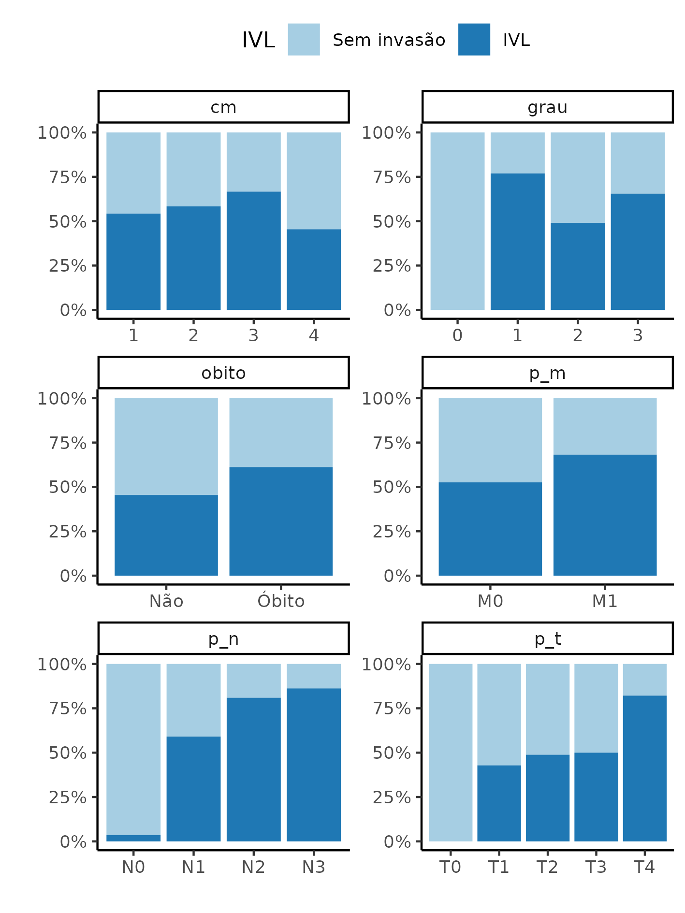

---

\newpage

**[title]**

**Histórico do documento**

|Versão |Alterações     |
|:------|:--------------|
|01     |Versão inicial |

---

# Lista de abreviaturas

# Contexto

## Objetivos

## Recepção e tratamento dos dados

# Metodologia

Os procedimentos de limpeza de dados, desenho do estudo e métodos de análise usados neste relatório estão descritos no documento anexo **SAP-2023-007-TG-v01**.

<!-- ## Parâmetros do estudo -->

<!-- ### Desenho do estudo -->

<!-- ### Critérios de inclusão e exclusão -->

<!-- ### Exposições -->

<!-- ### Desfechos -->

<!-- ### Covariáveis -->

<!-- ## Análises Estatísticas -->

Esta análise foi realizada utilizando-se o software `R` versão 4.2.1.

# Resultados

## População do estudo e acompanhamento

Table: **Tabela 1** caption

|             **Características**              | **N = 100** |
|:--------------------------------------------:|:-----------:|
|                  IVL, n (%)                  |  56 (56%)   |
|                 Óbito, n (%)                 |  67 (67%)   |
|       DVL (IT), Média (Desvio Padrão)        | 1.66 (0.94) |
|       DVL (PT), Média (Desvio Padrão)        | 9.46 (2.74) |
|                 Grau, n (%)                  |             |
|                      0                       |  3 (3.0%)   |
|                      1                       |  13 (13%)   |
|                      2                       |  55 (55%)   |
|                      3                       |  29 (29%)   |
|                 CM=4, n (%)                  |             |
|                      1                       |  35 (35%)   |
|                      2                       |  48 (48%)   |
|                      3                       |  6 (6.0%)   |
|                      4                       |  11 (11%)   |
|                  pT, n (%)                   |             |
|                      T0                      |  3 (3.0%)   |
|                      T1                      |  14 (14%)   |
|                      T2                      |  43 (43%)   |
|                      T3                      |  12 (12%)   |
|                      T4                      |  28 (28%)   |
|                  pM, n (%)                   |             |
|                      N0                      |  28 (28%)   |
|                      N1                      |  22 (22%)   |
|                      N2                      |  21 (21%)   |
|                      N3                      |  29 (29%)   |
|                  pM, n (%)                   |             |
|                      M0                      |  78 (78%)   |
|                      M1                      |  22 (22%)   |
| Tamanho do tumor (mm), Média (Desvio Padrão) |   43 (26)   |
| Número de linfonodos, Média (Desvio Padrão)  |    6 (8)    |
|         KI67, Média (Desvio Padrão)          |   19 (20)   |

**Figura 1** caption

**Figura 2** caption

## Análise inferencial

Table: **Tabela 2** caption

|             **Características**              | **Total**, N = 100 | **0**, N = 44 | **1**, N = 56 | **Valor p** |
|:--------------------------------------------:|:------------------:|:-------------:|:-------------:|:-----------:|
|                 Óbito, n (%)                 |      67 (67%)      |   26 (59%)    |   41 (73%)    |    0.198    |
|       DVL (IT), Média (Desvio Padrão)        |    1.66 (0.94)     |  1.37 (0.64)  |  1.89 (1.07)  |  __0.009__  |
|       DVL (PT), Média (Desvio Padrão)        |    9.46 (2.74)     |  9.23 (2.65)  |  9.65 (2.82)  |    0.554    |
|                 Grau, n (%)                  |                    |               |               |  __0.039__  |
|                      0                       |      3 (3.0%)      |   3 (6.8%)    |    0 (0%)     |             |
|                      1                       |      13 (13%)      |   3 (6.8%)    |   10 (18%)    |             |
|                      2                       |      55 (55%)      |   28 (64%)    |   27 (48%)    |             |
|                      3                       |      29 (29%)      |   10 (23%)    |   19 (34%)    |             |
|                 CM=4, n (%)                  |                    |               |               |    0.801    |
|                      1                       |      35 (35%)      |   16 (36%)    |   19 (34%)    |             |
|                      2                       |      48 (48%)      |   20 (45%)    |   28 (50%)    |             |
|                      3                       |      6 (6.0%)      |   2 (4.5%)    |   4 (7.1%)    |             |
|                      4                       |      11 (11%)      |    6 (14%)    |   5 (8.9%)    |             |
|                  pT, n (%)                   |                    |               |               |  __0.006__  |
|                      T0                      |      3 (3.0%)      |   3 (6.8%)    |    0 (0%)     |             |
|                      T1                      |      14 (14%)      |    8 (18%)    |    6 (11%)    |             |
|                      T2                      |      43 (43%)      |   22 (50%)    |   21 (38%)    |             |
|                      T3                      |      12 (12%)      |    6 (14%)    |    6 (11%)    |             |
|                      T4                      |      28 (28%)      |    5 (11%)    |   23 (41%)    |             |
|                  pM, n (%)                   |                    |               |               | __<0.001__  |
|                      N0                      |      28 (28%)      |   27 (61%)    |   1 (1.8%)    |             |
|                      N1                      |      22 (22%)      |    9 (20%)    |   13 (23%)    |             |
|                      N2                      |      21 (21%)      |   4 (9.1%)    |   17 (30%)    |             |
|                      N3                      |      29 (29%)      |   4 (9.1%)    |   25 (45%)    |             |
|                  pM, n (%)                   |                    |               |               |    0.230    |
|                      M0                      |      78 (78%)      |   37 (84%)    |   41 (73%)    |             |
|                      M1                      |      22 (22%)      |    7 (16%)    |   15 (27%)    |             |
| Tamanho do tumor (mm), Média (Desvio Padrão) |      43 (26)       |    33 (18)    |    50 (29)    |  __0.003__  |
| Número de linfonodos, Média (Desvio Padrão)  |       6 (8)        |     2 (3)     |    10 (9)     | __<0.001__  |
|         KI67, Média (Desvio Padrão)          |      19 (20)       |    17 (20)    |    20 (21)    |    0.233    |

# Observações e limitações

# Conclusões

# Referências

- **SAP-2023-007-TG-v01** -- Plano Analítico para [title]

# Apêndice

## Análise exploratória de dados

## Disponibilidade

Todos os documentos gerados nessa consultoria foram incluídos no portfólio do consultor.

<!-- O cliente solicitou que esta análise seja mantida confidencial até uma futura data, determinada pelo próprio cliente. -->
<!-- Todos os documentos gerados nessa consultoria portanto não foram publicados online e apenas o título e o ano da análise foram incluídas no portfólio do consultor. -->
<!-- Após a data acordada, os documentos serão disponibilizados. -->

<!-- O cliente solicitou que esta análise seja mantida confidencial. -->
<!-- Todos os documentos gerados nessa consultoria portanto não foram publicados online e apenas o título e o ano da análise foram incluídas no portfólio do consultor. -->

O portfólio pode ser visto em:

<https://philsf-biostat.github.io/SAR-2023-007-TG/>

## Dados utilizados

A tabela A1 mostra a estrutura  da tabela de dados analíticos.

| id  | exposure | obito | dvl_it | dvl_pt | grau | cm | p_t | p_n | p_m | tu | num_linf | ki67 |
|:---:|:--------:|:-----:|:------:|:------:|:----:|:--:|:---:|:---:|:---:|:--:|:--------:|:----:|
|  1  |          |       |        |        |      |    |     |     |     |    |          |      |
|  2  |          |       |        |        |      |    |     |     |     |    |          |      |
|  3  |          |       |        |        |      |    |     |     |     |    |          |      |
| ... |          |       |        |        |      |    |     |     |     |    |          |      |
|  N  |          |       |        |        |      |    |     |     |     |    |          |      |

Table: **Tabela A1** Estrutura da tabela de dados analíticos

Os dados utilizados neste relatório não podem ser publicados online por questões de sigilo.
